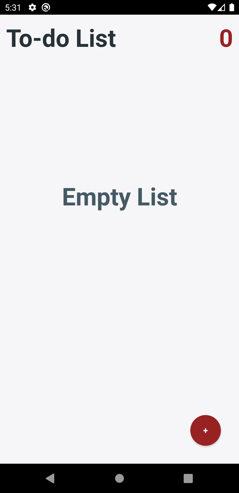
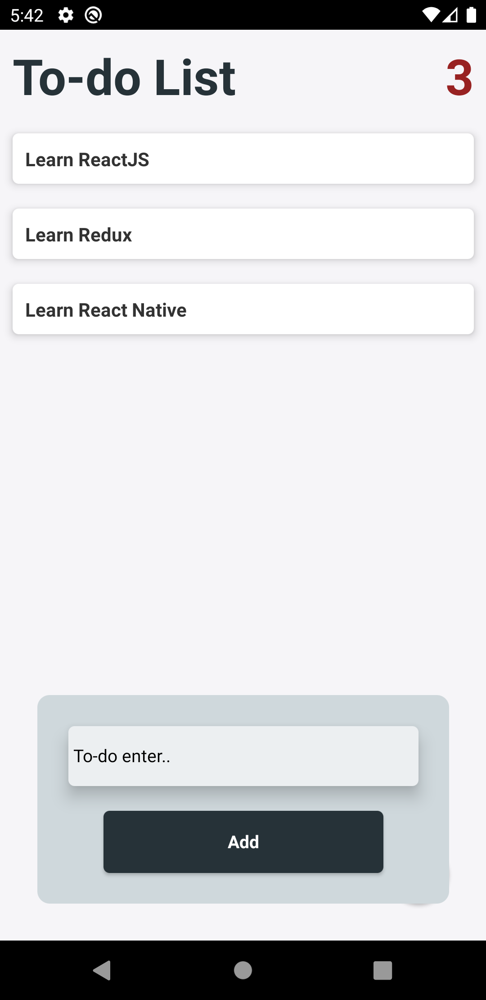
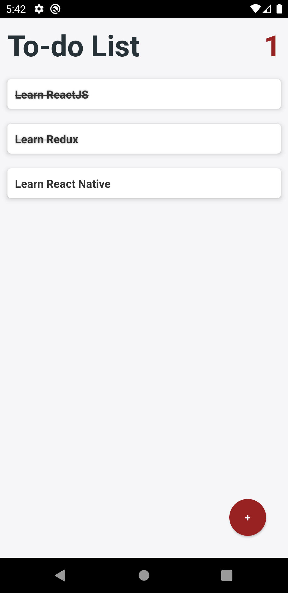

# To-do App

  

## Kurulum

React Native

## Tools

-Asyncstorage

## Özellikler

- Yapılacakları listeleyebilme.
- Yapılması gereken öğeyi basıldığında yapıldı olarak işaretlemek ve üzerini çizmek.
- Uzun basıldığında yapılacak öğesinin tamamlanması ve silinmesi.
- Ekranın sağ üst köşesinde aktif öğelerin sayısını gösterebilme.
- Yapılacak görevin eklenmesi, durumunun değiştirilmesi ve silinmesi işlemlerini telefonun hafızasında tutma.

## Başlangıç

Bu depoyu yerel makinenizde klonlayın.

```
git clone https://github.com/ibrahimaykutbas/patika-react-native.git
```

### Kullanım

Projeyi klonladıktan sonra kullanmak için:

```
cd patika-react-native/To-do App
cd .
```

Proje bağımlılıklarını yüklemek için proje klasörüne aşağıdaki komutları çalıştırın.

```
npm init
npm install
```

Bu talimatlar, geliştirme ve test amacıyla yerel makinenizde projenin bir kopyasını hazır ve çalışır hale getirecektir.

## Kullanılabilir Komut Dosyaları

Proje dizininde şunları çalıştırabilirsiniz:

```
npx react-native run-android
```

## Daha Fazla Bilgi İçin

Daha fazlasını şuradan öğrenebilirsiniz: [React documentation](https://reactnative.dev/)
